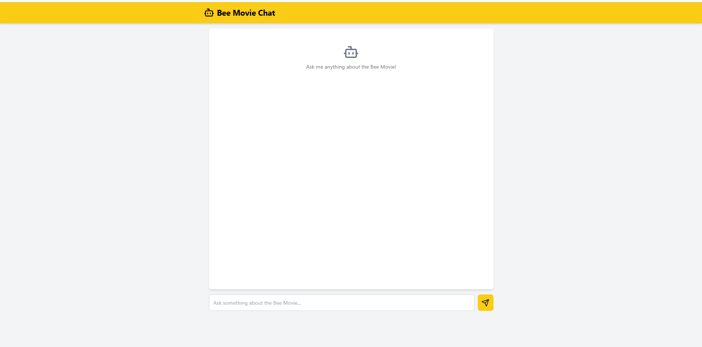

# Bee Movie Conversational AI





This is a Flask-based web application that leverages the power of `langchain` and the `Mistral-7B-Instruct-v0.1` language model from Hugging Face to create a conversational AI based on the Bee Movie script. The app retrieves information from the Bee Movie script and uses that to respond to user queries.

## Project Details

### Features:
- **Conversational AI**: The app can respond to user input based on the Bee Movie script.
- **Script Processing**: The entire Bee Movie script is downloaded and split into chunks, which are then embedded and stored in a vector database.
- **Use of Hugging Face Models**: The application uses the Mistral-7B-Instruct-v0.1 model for text generation.
- **Environment Variables**: API tokens and configuration settings are securely loaded from environment variables using `dotenv`.

### Technologies:
- **Flask**: A lightweight web framework for Python.
- **LangChain**: A framework for developing applications powered by large language models.
- **Chroma**: A vector store to store and retrieve embeddings for the Bee Movie script.
- **Hugging Face**: Using the Hugging Face API for the Mistral model.
- **CORS**: Flask extension for handling Cross-Origin Resource Sharing (CORS).
- **Python-dotenv**: For loading environment variables from `.env` files.

### How it Works:
1. The Bee Movie script is downloaded from a URL.
2. The script is split into chunks and embedded using Hugging Face embeddings.
3. The script's chunks are stored in a vector store (Chroma) for efficient retrieval.
4. The `Mistral-7B-Instruct-v0.1` model from Hugging Face is used to generate responses based on user queries related to the Bee Movie script.
5. A Flask app serves the web interface where users can interact with the AI.

### Running the Project:
To run this project locally, follow the steps below:

1. Clone the repository:
   ```bash
   git clone <repository-url>
   cd <repository-directory>
